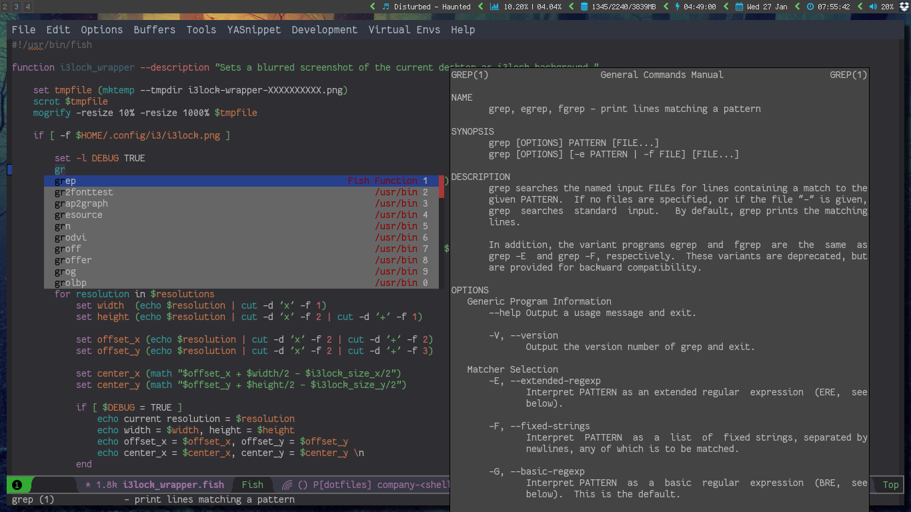

# Company Shell

company mode completion backend for your shell functions:

## Features

### Completion Candidates

`company-shell` will offer completions for 2 different sources:

* binaries that are found on your `$PATH`
* fish-shell's functions, if it is installed

`company-shell` will detect if fish-shell is installed by trying to find an executable named `fish`.
If it's found it will collect the output of the `functions` command, which will fetch both fish-shell's
builtin as well any user defined functions.

The list of completions will be (optionally) purged from possible duplicate entries and sorted alphabetically.

### Doc Strings

`company-shell` will first try to find documentation for candidate *c* by checking the output of `man c`.
If *c* does not have a manpage it will then try the output of `c --help` and then `c -h`. The meta doc-string
(shown in the minibuffer during completion) is provided by (the first line of) `whatis c`.

### Caching

As the process of searching though the content of your `$PATH` and building the completion lists is likely
to cause a visible delay it is done exactly once - when `company-shell` is invoked for the first time.
The list of all possible completions will then be saved in the variable `company-shell--cache`. This
cache may be manually rebuilt by interactively executing `company-shell-create-completion-list`.

## Setup

Add `company-shell` to your `company-backends`:
`(add-to-list 'company-backends 'company-shell)`

## Configuration Variables:

* company-shell-delete-duplicates t:

If non-nil the list of completions will be purged of duplicates. Duplicates in this context means any two
string-equal entries, regardless where they have been found. This would prevent a completion candidate
appearing twice because it is found in both /usr/bin/ and /usr/local/bin.
For a change to this variable to take effect the cache needs to be rebuilt via `company-shell-create-completion-list`.

* company-shell-modes '(sh-mode fish-mode):

List of major modes where `company-shell` will be providing completions if it is part of `company-backends`.
All modes not on this list will be ignored. Set value to nil to enable company-shell regardless of current major-mode.

## Dependencies

* company
* cl-lib
* dash

## Future plans & maybes

* Better formatting for meta strings
* customize group interface
