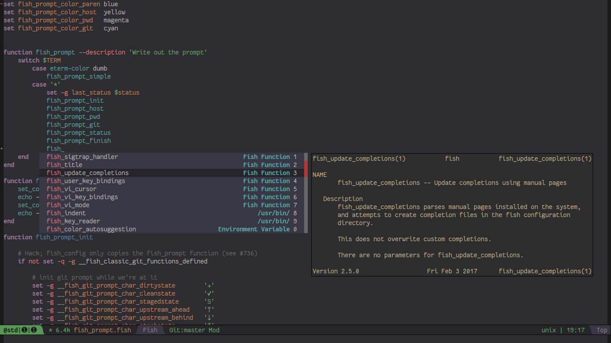

# Company Shell

company mode completion backends for your shell functions:

## Features

### Backends

`company-shell` offers 2 backends for 2 different sources:

* `company-shell` - providing completions for binaries that are found on your `$PATH`
* `company-fish-shell` - providing completions for fish-shell's functions, both builtin as well as user-defined

### Doc Strings

`company-shell` and `company-fish-shell` will both first try to find documentation for candidate *c* by checking
the output of `man c`. If *c* does not have a manpage it will then try the output of `c --help`. The latter needs
to be enabled manually (see the section about `company-shell-use-help-arg`). The meta doc-string (shown in the
minibuffer during completion) is provided by (the first line of) `whatis c`.

### Caching

As the process of searching though the content of your `$PATH` and building the completion lists is likely
to cause a visible delay it is done exactly once - when `company-shell` is invoked for the first time.
The list of all possible completions will then be saved in the variable `company-shell--cache`.
`company-fish-shell` follows the same pattern, its completions are stored in `company-shell--fish-cache`.

Both completion lists may be manually rebuilt by invoking `company-shell-rebuild-cache`.

## Setup

Add `company-(fish)-shell` to your `company-backends`:

`(add-to-list 'company-backends 'company-shell)`

To use both backends at once add them as a combined backend:

`(add-to-list 'company-backends '((company-shell company-fish-shell)))`

To learn more about combining backends see the doc-string of `company-backends`.

## Configuration Variables:

* `company-shell-delete-duplicates` (default value: t)

If non-nil the list of `company-shell's` completions will be purged of duplicates. Duplicates in this context means any two
string-equal entries, regardless where they have been found. This would prevent a completion candidate
appearing twice because it is found in both /usr/bin/ and /usr/local/bin.
For a change to this variable to take effect the cache needs to be rebuilt via `company-shell-rebuild-cache`.

* `company-shell-modes` (default value: sh-mode fish-mode shell-mode eshell-mode)

List of major modes where `company-shell` will be providing completions if it is part of `company-backends`.
All modes not on this list will be ignored. Set value to nil to enable `company-shell` regardless of current major-mode.

* `company-fish-shell-modes` (default value: fish-mode shell-mode)

List of major modes where `company-fish-shell` will be providing completions if it is part of `company-backends`.
All modes not on this list will be ignored. Set value to nil to enable `company-shell` regardless of current major-mode.

* `company-shell-use-help-arg` (default value: nil)

SETTING THIS TO t IS POTENTIALLY UNSAFE.

If non-nil `company-(fish)-shell` will try and find a doc-string by running `arg --help`
if `man arg` did not produce any valid results. This is not completely safe since
`company-shell` does not and can not know whether it is safe to run a command in this
fashion. Some applications may simply ignore or misinterpret this argument, with
unpredictable results. Usually this just means that instead of any actual documentation
you'll see an error message telling you the program doesn't know what to do with the
`--help` arg or that it was started with invalid input. In rare cases a program may simple
ignore the `--help` arg and directly spawn a GUI like xfce4-notes-settings does.

To mitigate any such issues company-shell will run the `--help` attempt on a timer of
1 second. This is more than enough to fetch the doc output if it is available, but will
quickly close any process that may accidentally have been spawned. In addition the command
will run in a restricted shell (via `$(which sh) --restricted`) to further avoid any unwanted
side effects.

Despite these precautions company-shell will nonetheless need to sometimes run completely unknown
binaries, which is why this option is turned off by default. You need to consciously enable
it in the understanding that you do this AT YOUR OWN RISK.

## Dependencies

* company
* cl-lib
* dash
